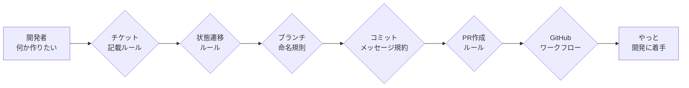
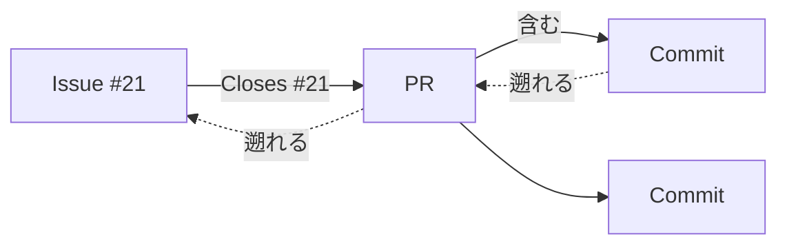

# ルールやフローはClaude Codeにお任せしてチケット駆動開発を自動化するフレームワークを作成し運用する

## はじめに

個人で開発している間はルールを定めず好き勝手に進められる。だがチームで開発するなら、誰がいつ何を目的に手を入れたのかを追えること、タスクを引き継げることが要る。そのために最低限のルールと開発フローを決めたい。

チケット駆動開発はその王道だ。作業内容をチケットで管理し、チケットごとにブランチを切り、実装後は Pull Request を経由してレビュー・マージする。開発履歴の追跡性とチーム内の情報共有が上がり、プロセスの品質も安定する。

問題は、運用に乗せた途端に覚えることが一気に増える点にある。開発者が「何か作りたい」と思ってから実際にコードを書き始めるまで、いくつものルールの関門を通らされる。



これらは一度決めれば終わりではなく、日々の開発で守り続けなければならない。とくに個人開発や小規模チームでは「ルールは決めたが結局守られない」に陥りやすい。人は面倒な手順を忘れるし、例外も起きる。どれだけ優れたプロセスでも、人手の運用に依存する限りどこかで崩れる。

そこで発想を変えた。人間にルールを覚えさせるのではなく、AI に覚えさせればいい。

**Claude Code** を中心に、チケット管理・ブランチ作成・Git 操作・Pull Request 作成までを会話だけで実行できるフレームワークを構築した。開発者は「次に何を作りたいか」を自然言語で伝えるだけでよく、チケット駆動開発に必要なルールと手順はフレームワーク側が担う。人は図の関門をすべて飛ばして、開発に集中できる。

本記事では、このフレームワークを設計した背景と仕組みを紹介する。

## ルールやワークフロー

### ルール

GitHub の Issue でチケット管理を行う。操作の細則は2つの instructions ファイルに分けてあり、ここでは要点だけを示す。

**GitHub の操作（→ [github-workflow.md](instructions/github-workflow.md)）**

- GitHub 操作は必ず `gh` コマンドで行い、ブラウザ前提の手順は踏まない
- 修正・機能追加は Issue に基づいて行う。Issue は「追加質問なしで着手できる粒度」で書き、対象ファイル・変更方針・受け入れ条件（テスト/検証方法）まで含める
- ブランチは用途別に命名する。`feature/<issue番号>-<説明>`、`bugfix/<issue番号>-<説明>`、`docs/<issue番号>-<説明>` の形をとり、本流ブランチでは直接作業しない
- PR は対応する Issue に紐付ける。PR 本文に `Closes #<issue番号>` を書く。GitHub は PR 本文の closing keyword でのみ Issue と PR を双方向につなぐので、ブランチ名や commit メッセージに番号を入れてもこの関連は作られない

**コミットメッセージ（→ [git-commit.md](instructions/git-commit.md)）**

- 1コミット＝1論点。メッセージは `type(scope): subject` 形式で書く。`type` は feat / fix / refactor / perf / test / docs / chore などから選ぶ
- subject には「何を変更したか」ではなく「コミット後に成立する振る舞い」を書く（例: `fix(auth): allow passwords longer than 20 characters`）
- 本文は diff を見れば分かる実装ではなく、変更の理由・設計判断・互換性やセキュリティへの影響だけを書く。互換性を壊す変更は `BREAKING CHANGE` を明記する

### Issue管理のフロー
- 要件作成：開発(新規機能・不具合修正・ドキュメント作成）前には必ず計画書を作成する
- チケット起票：要件をGitHub Issue のチケットとして発行する
- チケット選択：開発するチケットを選択する
- ブランチ作成：開発作業はブランチを切ってそこで行う
- 開発：Claude Code といっしょに開発
- テスト：Claude Code といっしょに開発物をテスト
- コミット：テストをPASSしたらコミット
- PR作成：チケットの作業内容一式をPRとして保存（あとから簡単にリバート可能）
- レビュー：Claude Code といっしにレビュー
- マージ：本流ブランチに取り込む

## 開発物

フレームワークは3つの部品でできている。それぞれ「型を与える」「品質を担保する」「手続きを動かす」という別の役割を持つ。

1. **Issue テンプレート（`.github/ISSUE_TEMPLATE/`）** — feature / bug / docs の3種類を Markdown で用意した。各ファイルの先頭に frontmatter があり、`title` の接頭辞（例 `feat(scope): `）と `labels` を持つ。後述の発行コマンドがこれを読んでタイトルとラベルを決める。どんな Issue を書くべきかを **型** として与える層。
2. **作業契約（`AGENTS.md` と `instructions/`）** — 人間と AI が共通で守る約束を書いたファイル群。`AGENTS.md` に最小限の契約を置き、コミット規約・GitHub 操作・ドキュメント文体といった細則は `instructions/` に分けて条件付きで読ませる。Issue やコミットの **品質** を担保する層。
3. **Claude Code の skill（`.claude/skills/`）** — `/ticket-template`・`/ticket-plan`・`/ticket-issue`・`/ticket-pr` の4つ。テンプレートを置いて手書きするか会話や計画から下書きを生成し、`gh` で発行し、実装したブランチを Issue に紐づく PR にするところまでを実行する。起票から PR までの **手続きを動かす** 層。


## 1. Issue テンプレートは Markdown にした

最初は GitHub の Issue Forms（YAML）で作っていた。入力欄が構造化され、必須チェックも
効くので一見よさそうに見える。ただ実際に使うと制約がきつかった。フィールドの種類が
固定で、節を自由に増減できず、レイアウトもほぼいじれない。

結局 Markdown テンプレートに切り替えた。`.github/ISSUE_TEMPLATE/` には3種類置いてある。

- `feature.md` … 新機能・機能改善
- `bug.md` … 不具合の報告と修正依頼
- `docs.md` … ドキュメントの追加・修正

Markdown テンプレートの良いところは、本文が自由記述になることだ。見出しはそのまま使い、
要らない節は消し、HTML コメントで「ここに何を書くか」のヒントを埋め込める。
代わりに必須バリデーションとドロップダウンは失われるので、記述の質は書き手の責任になる。
今回はその責任を契約ファイル側で担保する設計にした。

各テンプレートの先頭には frontmatter があり、`title` の接頭辞（例 `feat(scope): `）と
`labels` を持たせてある。後述の発行コマンドはこの frontmatter を読んでタイトルとラベルを
決める。なお `config.yml` だけは Markdown ではなく設定ファイルで、空 Issue の禁止と
誘導リンクを定義している。

## 2. 作業のルールは AGENTS.md に集約した

`AGENTS.md` は、このリポジトリで人間と AI が作業するときの契約だ。迷ったらここを最優先する。
中身は重くない。要点だけ挙げると次のとおり。

- 作業前に `README.md` と `instructions/` の該当ファイルを読む
- 変更は1ステップずつ入れ、直後に検証する
- コミットは「1コミット＝1論点」、メッセージは `type(scope): subject`
- 作成・更新したファイルの先頭に概要コメントを書く（この README にも付けてある）

細かい規約は `instructions/` に分けた。コミットの書き方は `instructions/git-commit.md`、
GitHub の操作手順は `instructions/github-workflow.md`、設計ドキュメントの文体は
`instructions/doc-writing.md` にある。`github-workflow.md` には
「GitHub 操作には必ず `gh` を使う」「ブラウザ前提の手順を書かない」というルールがあり、
これが今回のワークフロー全体の土台になっている。この README 自体も `doc-writing.md` の
文体ルール（散文優先、設計判断は対案とトレードオフを併記、要約節を作らない）に従って書いている。

契約を1ファイルにまとめておくと、作業のたびに前提を説明し直さずに済む。
テンプレートが要求する「着手できる粒度」も、ここで裏打ちしている。

## 3. /ticket-template・/ticket-plan・/ticket-issue・/ticket-pr で下書きから PR まで

ここが今回の本体だ。Claude Code の skill を4つ用意した。下書きを作る系が
2つ（`/ticket-template` と `/ticket-plan`）、発行する系が1つ（`/ticket-issue`）、
発行した Issue に紐づく PR を作る系が1つ（`/ticket-pr`）という構成だ。下書き作成と
発行を分けたのと同じ理由で、発行と PR 作成も別 skill に分けてある。Issue の発行と PR の
作成はどちらも外部に出る取り消しの難しい操作で、まとめて走らせると片方だけ直したいときに
困るからだ。

下書きを作る系を2つに分ける軸は、出力の件数（1 か N か）ではなく**本文を誰が書くか**だ。
`/ticket-template` はテンプレートを置くだけで人がゼロから手で書く。`/ticket-plan` は
会話や計画から本文を AI が生成する（1 件でも N 件でも生成できる）。件数で分けると
「計画から1件だけ起こす」がどちらに属するか曖昧になるが、書き手で分ければ迷わない。

### /ticket-template — テンプレートを置いて人が手で書く

`/ticket-template` を実行すると、まず種別（feature / bug / docs）を聞かれる。選ぶと対応する
テンプレートを `.issue_drafts/feature-20260615-085715.md` のようにタイムスタンプ付きで
`.issue_drafts/` へ**そのままコピー**し、その絶対パスが表示される。本文は生成しない。
パスをクリックして開き、人がゼロから手で書く。

この skill はもともと `/ticket` という名前で、テンプレートを丸ごとコピーするだけの足場だった。
途中で「その時点までの会話から本文を AI 生成する」方式に変えた時期があったが、それは
`/ticket-plan` が担う仕事（会話・計画からの生成）と重なっていた。`/ticket-plan` は件数を
問わず生成できるので 1 件もそちらで作れる。重複を解き、この skill は本来の「手書きの足場」に
戻して `/ticket-template` に改名した。会話を本文へ転記しないので、機密情報・個人情報が
下書きに紛れ込む経路がそもそも無いという利点もある。

生成しないぶん挙動は単純だ。種別に対応するテンプレートを `.github/ISSUE_TEMPLATE/` から
読み、frontmatter（`title` / `labels` 等）も本文の見出しもコメントも改変せずコピーする。
`title` の `feat(scope):` のようなプレースホルダもそのまま残るので、人が `scope` を埋め、
各節を書き、不要な節を消す。書き終えたら `/ticket-issue` で発行する。

### /ticket-plan — 会話・計画から下書きを生成する

`/ticket-template` が人の手書きの足場なのに対し、`/ticket-plan` は本文を AI が書く。設計の
相談はしばしば複数のチケットに分かれる作業計画として固まるので、会話や計画を読んで作業項目に
割り、項目ごとに下書きを生成する。生成する以上、件数は本質的な区別ではない。1 件でも N 件でも
同じ skill で作れる。

2つの下書き skill を分ける軸は、出力の件数（1 か N か）ではなく**本文を誰が書くか**に置いた。
件数で分けると「計画から1件だけ起こす」が `/ticket-template` と `/ticket-plan` のどちらに
属するか曖昧になる。書き手（人が手で書くのか、AI が生成するのか）で分ければ、その曖昧さは
消える。手で書きたいなら件数によらず `/ticket-template`、会話・計画から起こしたいなら件数に
よらず `/ticket-plan` だ。代償として下書き skill が2つに増えるが、その負担は名前
（`ticket-template` と `ticket-plan`）で吸収できる範囲だと判断した。

`/ticket-plan` は、会話または引数で渡した計画ファイル（例 `@PLAN.md`）から作業項目を
抽出して一覧で示し、各項目に種別を自動で割り当てる。種別の確認は項目ごとに聞かず、
対応表をまとめて1回で取る。確定したら、タイムスタンプを1度だけ取得して全項目で共有し、
`.issue_drafts/<type>-<timestamp>-NN.md`（`NN` は連番）の形で下書きを N 件生成する。最後に
全下書きの絶対パスを一覧表示する。

発行はこのコマンドに含めていない。N 件をまとめて発行すると、1件でも誤った下書きが
混ざったときに取り消しの効かない Issue が複数できてしまう。発行は1件ずつ `/ticket-issue`
に通す現状の手順を保ち、一括発行の便利さよりも誤起票の影響範囲を小さく保つ方を優先した。

### /ticket-issue — gh で発行する

下書きを書き終えたら `/ticket-issue @.issue_drafts/feature-20260613-165320.md` のように
ファイルを渡す。コマンドは frontmatter から `title` と `labels` を取り出し、
frontmatter を除いた本文を Issue の body として、

```
gh issue create --title "<title>" --label "<labels>" --body-file <body>
```

を実行する。リポジトリは `-R` を付けず、カレントの origin を自動で使う。
`--title` `--label` `--body-file` をすべて指定するので、エディタも確認プロンプトも
挟まらず非対話で発行できる。発行前には、タイトルに `scope` のようなプレースホルダが
残っていないか、受け入れ条件が空でないかを確認する手順を入れてある。
Issue は外部に公開され取り消しが難しいので、ここだけは明示の確認を挟む。

下書きの置き場は当初 `issues/` という名前だった。だがルート直下に `issues/` があると、
GitHub Issue 関連の成果物を追跡しているように見え、commit すべきか消してよいかの判断を
迷わせる。実体は発行したら不要になるローカルのスクラッチなので、名前で性格が分かる
`.issue_drafts/` へ改めた。先頭のドットでツール管理用の作業領域だと示し、`drafts` で
発行前の下書きだと示す。

このディレクトリは `.gitignore` で丸ごと除外している。リポジトリに残す対象ではないからだ。
当初は `.gitkeep` を置いてディレクトリだけ git に残すつもりだったが、`.gitignore` の
`/.issue_drafts/` が `.gitkeep` ごと無視していて、そもそも追跡されていなかった。
追跡しないという元の方針に合わせて `.gitkeep` は外し、ディレクトリは必要になった時点で
`/ticket-template` や `/ticket-plan` が作る方式へ統一した。

発行が済んだ下書きも残さない。`/ticket-issue` は `gh issue create` が Issue の URL を
返して発行が確定したのを確認してから、その下書きと一時ファイルを削除する。発行後は
GitHub が記録の正本になり、ローカルの下書きは古い写しにしかならないからだ。削除は
発行が確定したときだけで、発行前や失敗時には消さない。消す前に対象を提示して同意を取る。

### /ticket-pr — ブランチから PR を作る

発行した Issue は専用のブランチを切って実装する。実装を本流へ取り込むには PR を作るが、
ここで Issue との紐付けを取りこぼすと、数か月後に「この PR は何のためだったのか」が
追えなくなる。`/ticket-pr` はこの紐付けを人手の記憶に頼らず機械化する。

現在のブランチ名（`feature/<n>-...` や `docs/<n>-...`）の先頭から issue 番号 `<n>` を
取り出し、PR 本文の先頭に `Closes #<n>` を入れて `gh pr create` する。base には
default ブランチ（`master`）を既定で渡す。番号がブランチ名から取れないときは推測せず
利用者に尋ねる。PR も外部に出ると取り消しが難しいので、抽出した issue 番号・base・
タイトルを提示し、明示の同意を取ってから発行する。発行後は `closingIssuesReferences` を
読んで、狙った Issue が実際に紐付いたかをその場で確認する。

なぜ紐付けを PR 本文に書くのか、ブランチ名や commit ではなぜ駄目なのかは次節で述べる。

## 4. Issue・PR・コミットを双方向に辿れるようにする

チケット駆動開発の見返りは追跡性だ。理想は、Issue から対応する PR へ、PR からそこに
含まれるコミットへ降りられて、逆にコミットから PR へ、PR から Issue へ遡れる状態を、
GitHub 上に保存しておくことにある。



このうち PR とコミットの関係は GitHub が自動で持つ。PR 画面にはコミット一覧が出るし、
コミット画面からはそれを含む PR へ辿れる。問題は Issue と PR の関係で、これは黙っていては
作られない。GitHub が Issue と PR を双方向につなぐのは、**PR 本文に closing keyword を
書いたときだけ**だ。keyword は `close` / `closes` / `closed`、`fix` / `fixes` / `fixed`、
`resolve` / `resolves` / `resolved` の3系統で、`Closes #21` のように issue 番号を続ける。
これは GitHub 公式ドキュメントの
[Linking a pull request to an issue](https://docs.github.com/en/issues/tracking-your-work-with-issues/linking-a-pull-request-to-an-issue)
に明記された挙動だ。

紐付けの置き場所には3つの案があった。ブランチ名に番号を含める案（`feature/21-...`）、
commit メッセージに `#21` と書く案、PR 本文に `Closes #21` と書く案だ。前2つは採らなかった。
ブランチ名の番号は人間が読むためのラベルでしかなく、GitHub は Issue へのリンクを生成
しない。commit メッセージの `#21` は Issue 側に参照を残すものの、その commit を含む PR は
Issue の linked pull request として表示されず、Issue→PR の一覧から外れてしまう。結局、
双方向のリンクを残せるのは PR 本文の keyword だけで、ここに紐付けを集約した。代償として、
ブランチ名規則（`feature/<n>-...`）は追跡には寄与しないただの命名規約になる。`/ticket-pr`
がブランチ名から番号を拾って PR 本文へ転記するのは、この人間向けラベルと機械可読な
リンクの橋渡しをするためだ。

落とし穴がもう一つある。closing keyword はマージ先が default ブランチのときしか発火しない。
default 以外のブランチを base にした PR では keyword は無視され、リンクも自動クローズも
起きない。このリポジトリは default を `master` にしているので、PR は `master` を base に
する。これに合わせて `github-workflow.md` の記述も、存在しない `develop` 前提を消して
実際の `master` 運用へ直した。

この keyword を毎回手で書かせると、いつか忘れる。だから二段で守っている。`.github/`
直下に置いた PR テンプレート（`PULL_REQUEST_TEMPLATE.md`）が `Related Issue` の節に
`Closes #` を最初から並べ、`/ticket-pr` がそこへ番号を埋める。テンプレートが書き忘れを
防ぎ、コマンドが番号の取り違えを防ぐ。

## 流れをまとめると

```
/ticket-template            # 人が手で書く下書きの足場
  → 種別を選ぶ（feature / bug / docs）
  → テンプレートをそのまま .issue_drafts/<type>-<timestamp>.md にコピー（本文は生成しない）
  → 表示された絶対パスをクリックして人が手で記入

/ticket-plan [@PLAN.md]     # 会話・計画から AI が生成（1 件でも N 件でも）
  → 会話または計画ファイルから作業項目を抽出し一覧表示
  → 各項目に種別を割り当て（まとめて1回確認）
  → .issue_drafts/<type>-<timestamp>-NN.md が作られ、全パスを一覧表示

/ticket-issue @.issue_drafts/<file>.md
  → frontmatter から title / label を取得
  → 本文を body にして gh issue create
  → 発行された Issue の URL が返る
  → 発行が確定したら下書きを削除する

feature/<issue番号>-<説明> ブランチを切って実装・コミット

/ticket-pr
  → ブランチ名から issue 番号を取り出す
  → PR 本文に Closes #<番号> を入れて gh pr create（base は master）
  → closingIssuesReferences で紐付きを確認

PR をレビューして master にマージ
  → Closes # が発火し Issue が自動でクローズ
  → Issue・PR・コミットが双方向に辿れる状態が残る
```

起票の品質はテンプレートと契約で担保し、本文は会話から起こし、操作はすべて `gh` に
寄せた。ブラウザに戻る場面は基本的にない。Issue から PR、PR からコミット、その逆も、
あとから GitHub 上で追える。

## hello world で一通り通した

机上の説明だけでは動くか分からない。読者が手元で試すなら、Claude Code に2回指示するだけでいい。

最初に開発計画とチケットを作らせる。

```
最初に、わたしは rust と C と python で hello,world作成する開発計画を作成してほしい。それぞれ別々のチケットと作成しなさい
# => ./issues にチケットを３つ作成
```

「発行するか？」と聞かれるので、発行と実装をまとめて指示する。

```
すべて発行しなさい、そのあと実装しなさい
# => ./hello に開発内容が保存され、ビルド・実行され、計画どおり完了したと報告される
```

この2言で何が起きるかを順に追う。

最初の指示で `/ticket-plan` が走り、計画を3件の作業項目へ分解する。種別の確認は項目ごとではなく対応表1枚でまとめて聞かれ（3件とも feature）、`.issue_drafts/feature-<timestamp>-01.md` から `-03.md` までが同一タイムスタンプ＋連番で `.issue_drafts/` に生成される。ここで止まり、発行はされない。

2回目の指示で `/ticket-issue` が下書きを1件ずつ発行し、Issue が3つ立つ（今回は #10 Rust・#11 C・#12 Python）。frontmatter の `title` がそのままチケット名になり、`scope` のプレースホルダは具体名（`hello/rust` 等）へ置き換わる。続けて実装に入り、`hello/rust/`（cargo プロジェクト）・`hello/c/`（Makefile 付き C ソース）・`hello/python/`（python3 スクリプト）が言語別ディレクトリに作られる。

結果として手元に残るのは、3つの Issue と、ビルドして実行できる3言語の hello world だ。いずれも標準出力に `Hello, world!` を出す。

```
# Rust
cd hello/rust && cargo run

# C
cd hello/c && make run        # もしくは make してから ./hello

# Python
python3 hello/python/hello.py
```

つまり「3言語で hello world を作る計画を立てて」「全部発行して実装して」の2言だけで、起票・ブランチ作業・実装・検証までエージェントが駆動する。人間が出したのは計画の指示と発行の承認だけだ。これがこのフレームワークで得られる体験になる。

## ハマったところ

きれいに動いたわけではない。実際に詰まった2点を残しておく。

**エディタのウィンドウを狙えない。** 最初は下書き作成コマンド（現 `/ticket-template`）が
下書きを Zed で自動的に開く作りだった。ところが意図したウィンドウとは別のウィンドウで開いてしまう。
調べると、Zed の CLI は「呼び出したターミナルが属するウィンドウ」を指定できず、
最後にアクティブだったウィンドウに開く仕様だった。`--add` を付けても狙った窓に入るとは
限らない。結局、自動起動はやめて絶対パスを表示するだけにした。どのエディタでどう開くかは、
クリックする人に委ねたほうが確実だった。

**新しいリポジトリにはラベルが無い。** `/ticket-issue` を初めて流したとき、
`gh issue create --label feature` がラベル未登録で失敗した。テンプレートは `feature`
`bug` `documentation` のラベルが存在する前提だが、作りたてのリポジトリには何も無い。
`gh label create` で3つ作って解決し、コマンドの注意書きにも、発行前に `gh label list`
で確認する手順を足した。
