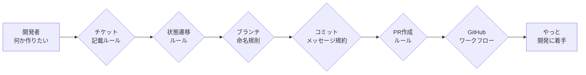
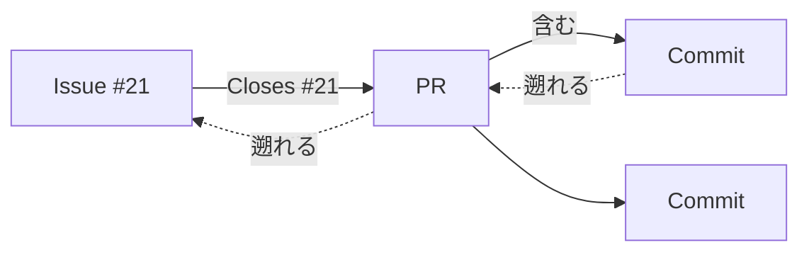

<!--
概要: チケット駆動開発フレームワークの設計ノート。
README から移した設計の背景・判断の記録。各部品をなぜその形にしたか、採用/不採用の根拠を残す。
利用方法は README、秘密情報スキャンの詳細は docs/secret-scan.md を参照。
-->

# 設計ノート

このフレームワークを設計した背景と、各部品でなぜその形を選んだかの記録。利用方法は
[README](../README.md) を参照する。

## 背景 — なぜ AI にルールを持たせるか

個人で開発している間はルールを定めず好き勝手に進められる。だがチームで開発するなら、誰がいつ何を目的に手を入れたのかを追えること、タスクを引き継げることが要る。そのために最低限のルールと開発フローを決めたい。

チケット駆動開発はその王道だ。作業内容をチケットで管理し、チケットごとにブランチを切り、実装後は Pull Request を経由してレビュー・マージする。開発履歴の追跡性とチーム内の情報共有が上がり、プロセスの品質も安定する。

問題は、運用に乗せた途端に覚えることが一気に増える点にある。開発者が「何か作りたい」と思ってから実際にコードを書き始めるまで、いくつものルールの関門を通らされる。

これらは一度決めれば終わりではなく、日々の開発で守り続けなければならない。とくに個人開発や小規模チームでは「ルールは決めたが結局守られない」に陥りやすい。人は面倒な手順を忘れるし、例外も起きる。どれだけ優れたプロセスでも、人手の運用に依存する限りどこかで崩れる。

そこで発想を変えた。人間にルールを覚えさせるのではなく、AI に覚えさせればいい。**Claude Code** を中心に、チケット管理・ブランチ作成・Git 操作・Pull Request 作成までを会話だけで実行できるフレームワークを構築した。開発者は「次に何を作りたいか」を自然言語で伝えるだけでよく、チケット駆動開発に必要なルールと手順はフレームワーク側が担う。

## 1. Issue テンプレートは Markdown にした

最初は GitHub の Issue Forms（YAML）で作っていた。入力欄が構造化され、必須チェックも
効くので一見よさそうに見える。ただ実際に使うと制約がきつかった。フィールドの種類が
固定で、節を自由に増減できず、レイアウトもほぼいじれない。

結局 Markdown テンプレートに切り替えた。`.github/ISSUE_TEMPLATE/` には3種類置いてある。

- `feature.md` … 新機能・機能改善
- `bug.md` … 不具合の報告と修正依頼
- `docs.md` … ドキュメントの追加・修正

Markdown テンプレートの良いところは、本文が自由記述になることだ。見出しはそのまま使い、
要らない節は消し、HTML コメントで「ここに何を書くか」のヒントを埋め込める。
代わりに必須バリデーションとドロップダウンは失われるので、記述の質は書き手の責任になる。
今回はその責任を契約ファイル側で担保する設計にした。

各テンプレートの先頭には frontmatter があり、`title` の接頭辞（例 `feat(scope): `）と
`labels` を持たせてある。後述の発行コマンドはこの frontmatter を読んでタイトルとラベルを
決める。なお `config.yml` だけは Markdown ではなく設定ファイルで、空 Issue の禁止と
誘導リンクを定義している。

## 2. 作業のルールは AGENTS.md と skill に分けた

`AGENTS.md` は、このリポジトリで人間と AI が作業するときの契約だ。迷ったらここを最優先する。
中身は重くない。常時守る最小限の契約（1ステップずつ検証・1コミット1論点・ファイル先頭の
概要コメント・branch + PR 必須）だけを置く。

細かい規約は Claude Code の skill に分けた。コミットの書き方は `git-commit` skill、GitHub の
操作手順は `github-workflow` skill、設計ドキュメントの文体は `doc-writing` skill にある。skill は
description の発火条件に応じて必要なときだけ自動で読み込まれるので、AGENTS.md からの明示的な
読み込み指定は要らない。`github-workflow` skill には「GitHub 操作には必ず `gh` を使う」「ブラウザ
前提の手順を書かない」というルールがあり、これがワークフロー全体の土台になっている。

当初はこれらの細則を `instructions/` ディレクトリに置き、AGENTS.md のテーブルから条件付きで
読み込ませていた（GitHub Copilot 向けの構成）。Claude Code に寄せる際、条件付き読み込みは skill の
自動ロードと役割が重複していたため、細則を skill へ移し、AGENTS.md は常時契約 + skill 索引へ
縮約した。フック機構の設計説明（秘密情報スキャン）はタスク手順でなく参考資料なので、skill 化せず
[docs/secret-scan.md](secret-scan.md) へ置いた。

## 3. /ticket-template・/ticket-draft・/ticket-publish・/ticket-pr-publish で下書きから PR まで

Claude Code の skill を4つ用意した。下書きを作る系が2つ（`/ticket-template` と `/ticket-draft`）、
発行する系が1つ（`/ticket-publish`）、発行した Issue に紐づく PR を作る系が1つ
（`/ticket-pr-publish`）という構成だ。下書き作成と発行を分けたのと同じ理由で、発行と PR 作成も
別 skill に分けてある。Issue の発行と PR の作成はどちらも外部に出る取り消しの難しい操作で、
まとめて走らせると片方だけ直したいときに困るからだ。

名前にもこの境界を出した。`template` と `draft` は **ローカル作業**（`.issue_drafts/` に
ファイルを作るだけ）、`publish` は **GitHub への登録**を表す。動詞を見れば、その skill が
手元で完結するのか外部に出るのかが分かる。さらに性格の違いを起動条件にも反映した。
ローカルの `/ticket-template`・`/ticket-draft` はファイルを作るだけで安全なので自然言語の
依頼からの自動起動を許容するが、GitHub に出る `/ticket-publish`・`/ticket-pr-publish` は
**明示的にコマンドを呼んだときだけ**起動する（「issue 作って」のような曖昧な依頼では
動かさない）。発行直前の同意確認と合わせ、取り消しの難しい操作を二段で守る。

下書きを作る系を2つに分ける軸は、出力の件数（1 か N か）ではなく**本文を誰が書くか**だ。
`/ticket-template` はテンプレートを置くだけで人がゼロから手で書く。`/ticket-draft` は
会話や計画から本文を AI が生成する（1 件でも N 件でも生成できる）。件数で分けると
「計画から1件だけ起こす」がどちらに属するか曖昧になるが、書き手で分ければ迷わない。

### /ticket-template — テンプレートを置いて人が手で書く

`/ticket-template` を実行すると、まず種別（feature / bug / docs）を聞かれる。選ぶと対応する
テンプレートを `.issue_drafts/feature-20260615-085715.md` のようにタイムスタンプ付きで
`.issue_drafts/` へ**そのままコピー**し、その絶対パスが表示される。本文は生成しない。
パスをクリックして開き、人がゼロから手で書く。

この skill はもともと `/ticket` という名前で、テンプレートを丸ごとコピーするだけの足場だった。
途中で「その時点までの会話から本文を AI 生成する」方式に変えた時期があったが、それは
`/ticket-draft` が担う仕事（会話・計画からの生成）と重なっていた。`/ticket-draft` は件数を
問わず生成できるので 1 件もそちらで作れる。重複を解き、この skill は本来の「手書きの足場」に
戻して `/ticket-template` に改名した。会話を本文へ転記しないので、機密情報・個人情報が
下書きに紛れ込む経路がそもそも無いという利点もある。

### /ticket-draft — 会話・計画から下書きを生成する

`/ticket-template` が人の手書きの足場なのに対し、`/ticket-draft` は本文を AI が書く。設計の
相談はしばしば複数のチケットに分かれる作業計画として固まるので、会話や計画を読んで作業項目に
割り、項目ごとに下書きを生成する。生成する以上、件数は本質的な区別ではない。1 件でも N 件でも
同じ skill で作れる。

`/ticket-draft` は、会話または引数で渡した計画ファイル（例 `@PLAN.md`）から作業項目を
抽出して一覧で示し、各項目に種別を自動で割り当てる。種別の確認は項目ごとに聞かず、
対応表をまとめて1回で取る。確定したら、タイムスタンプを1度だけ取得して全項目で共有し、
`.issue_drafts/<type>-<timestamp>-NN.md`（`NN` は連番）の形で下書きを N 件生成する。最後に
全下書きの絶対パスを一覧表示する。

発行はこのコマンドに含めていない。N 件をまとめて発行すると、1件でも誤った下書きが
混ざったときに取り消しの効かない Issue が複数できてしまう。発行は1件ずつ `/ticket-publish`
に通す現状の手順を保ち、一括発行の便利さよりも誤起票の影響範囲を小さく保つ方を優先した。

### /ticket-publish — gh で発行する

下書きを書き終えたら `/ticket-publish @.issue_drafts/feature-20260613-165320.md` のように
ファイルを渡す。コマンドは frontmatter から `title` と `labels` を取り出し、frontmatter を
除いた本文を Issue の body として `gh issue create --title <title> --label <labels> --body-file <body>`
を実行する。リポジトリは `-R` を付けず、カレントの origin を自動で使う。`--title` `--label`
`--body-file` をすべて指定するので、エディタも確認プロンプトも挟まらず非対話で発行できる。
発行前には、タイトルに `scope` のようなプレースホルダが残っていないか、受け入れ条件が空でないかを
確認する手順を入れてある。Issue は外部に公開され取り消しが難しいので、ここだけは明示の確認を挟む。

下書きの置き場は当初 `issues/` という名前だった。だがルート直下に `issues/` があると、
GitHub Issue 関連の成果物を追跡しているように見え、commit すべきか消してよいかの判断を
迷わせる。実体は発行したら不要になるローカルのスクラッチなので、名前で性格が分かる
`.issue_drafts/` へ改めた。このディレクトリは `.gitignore` で丸ごと除外している。発行が済んだ
下書きも残さない。`/ticket-publish` は `gh issue create` が Issue の URL を返して発行が確定したのを
確認してから、その下書きと一時ファイルを削除する。発行後は GitHub が記録の正本になり、ローカルの
下書きは古い写しにしかならないからだ。

### /ticket-pr-publish — ブランチから PR を作る

発行した Issue は専用のブランチを切って実装する。実装を本流へ取り込むには PR を作るが、
ここで Issue との紐付けを取りこぼすと、数か月後に「この PR は何のためだったのか」が
追えなくなる。`/ticket-pr-publish` はこの紐付けを人手の記憶に頼らず機械化する。

現在のブランチ名（`feature/<n>-...` や `docs/<n>-...`）の先頭から issue 番号 `<n>` を
取り出し、PR 本文の先頭に `Closes #<n>` を入れて `gh pr create` する。base には
default ブランチ（`master`）を既定で渡す。番号がブランチ名から取れないときは推測せず
利用者に尋ねる。PR も外部に出ると取り消しが難しいので、抽出した issue 番号・base・
タイトルを提示し、明示の同意を取ってから発行する。発行後は `closingIssuesReferences` を
読んで、狙った Issue が実際に紐付いたかをその場で確認する。

## 4. Issue・PR・コミットを双方向に辿れるようにする

チケット駆動開発の見返りは追跡性だ。理想は、Issue から対応する PR へ、PR からそこに
含まれるコミットへ降りられて、逆にコミットから PR へ、PR から Issue へ遡れる状態を、
GitHub 上に保存しておくことにある。

このうち PR とコミットの関係は GitHub が自動で持つ。PR 画面にはコミット一覧が出るし、
コミット画面からはそれを含む PR へ辿れる。問題は Issue と PR の関係で、これは黙っていては
作られない。GitHub が Issue と PR を双方向につなぐのは、**PR 本文に closing keyword を
書いたときだけ**だ。keyword は `close` / `closes` / `closed`、`fix` / `fixes` / `fixed`、
`resolve` / `resolves` / `resolved` の3系統で、`Closes #21` のように issue 番号を続ける。
これは GitHub 公式ドキュメントの
[Linking a pull request to an issue](https://docs.github.com/en/issues/tracking-your-work-with-issues/linking-a-pull-request-to-an-issue)
に明記された挙動だ。

紐付けの置き場所には3つの案があった。ブランチ名に番号を含める案（`feature/21-...`）、
commit メッセージに `#21` と書く案、PR 本文に `Closes #21` と書く案だ。前2つは採らなかった。
ブランチ名の番号は人間が読むためのラベルでしかなく、GitHub は Issue へのリンクを生成
しない。commit メッセージの `#21` は Issue 側に参照を残すものの、その commit を含む PR は
Issue の linked pull request として表示されず、Issue→PR の一覧から外れてしまう。結局、
双方向のリンクを残せるのは PR 本文の keyword だけで、ここに紐付けを集約した。代償として、
ブランチ名規則（`feature/<n>-...`）は追跡には寄与しないただの命名規約になる。`/ticket-pr-publish`
がブランチ名から番号を拾って PR 本文へ転記するのは、この人間向けラベルと機械可読な
リンクの橋渡しをするためだ。

落とし穴がもう一つある。closing keyword はマージ先が default ブランチのときしか発火しない。
default 以外のブランチを base にした PR では keyword は無視され、リンクも自動クローズも
起きない。このリポジトリは default を `master` にしているので、PR は `master` を base に
する。この keyword を毎回手で書かせるといつか忘れるので、二段で守っている。`.github/`
直下に置いた PR テンプレート（`PULL_REQUEST_TEMPLATE.md`）が `Related Issue` の節に
`Closes #` を最初から並べ、`/ticket-pr-publish` がそこへ番号を埋める。テンプレートが書き忘れを
防ぎ、コマンドが番号の取り違えを防ぐ。

## 5. 秘密情報・個人情報をアップロード前に止める

外部公開につながる操作（Issue・PR のアップロード、commit の push）で秘密鍵や個人情報を
載せると、GitHub 上で公開・キャッシュ・インデックスされ回収できない。これを人手の注意では
なく機械的なゲートで止める。git 経路（commit→push）は pre-commit（L1）で、git 履歴を通らない
gh 経路（`gh issue/pr create` の本文）は Claude Code の PreToolUse フック（L3）で、いずれも
gitleaks を共有して走査する。設計の根拠・検出範囲・allowlist の足し方・既知の制約は
[docs/secret-scan.md](secret-scan.md) にまとめてある。

## ハマったところ

**エディタのウィンドウを狙えない。** 最初は下書き作成コマンド（現 `/ticket-template`）が
下書きを Zed で自動的に開く作りだった。ところが意図したウィンドウとは別のウィンドウで開いてしまう。
調べると、Zed の CLI は「呼び出したターミナルが属するウィンドウ」を指定できず、
最後にアクティブだったウィンドウに開く仕様だった。`--add` を付けても狙った窓に入るとは
限らない。結局、自動起動はやめて絶対パスを表示するだけにした。どのエディタでどう開くかは、
クリックする人に委ねたほうが確実だった。

**新しいリポジトリにはラベルが無い。** `/ticket-publish` を初めて流したとき、
`gh issue create --label feature` がラベル未登録で失敗した。テンプレートは `feature`
`bug` `documentation` のラベルが存在する前提だが、作りたてのリポジトリには何も無い。
`gh label create` で3つ作って解決し、コマンドの注意書きにも、発行前に `gh label list`
で確認する手順を足した。
