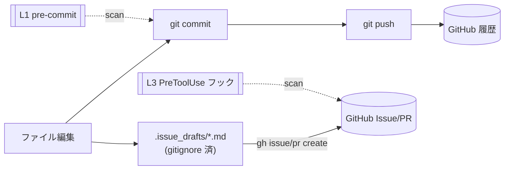

# 秘密情報・個人情報スキャンの運用契約

いつ読むか: 外部へ情報を出す操作（commit / push / Issue・PR のアップロード）を変更するとき、スキャンの誤検知・検出漏れに対処するとき、検出ルールや allowlist を編集するとき。

このドキュメントは、秘密鍵・トークン・個人情報が GitHub へ流出するのを機械的に止める仕組みと、その運用上の約束を定める。迷ったら AGENTS.md の方針を優先する。

## 何を止めるか

流出は外部へ出る境界で起きる。GitHub へ一度出した情報は公開・キャッシュ・インデックスされ、コミット履歴から消しても他者の clone や通知メールに残るため、出した後の回収はできない前提で扱う。境界はこのリポジトリに2系統あり、通る場所が違う。



git 経路（commit→push）の中身は追跡対象ファイルの履歴に入る。gh 経路（`gh issue create` / `gh pr create`）がアップロードする本文や `.issue_drafts/` の下書きは `.gitignore` 済みで、コミットされず git 履歴を通らない。このため pre-commit では gh 経路を一切見られない。2系統を別々のゲートで塞ぐのが設計の中心になる。

## 層の構成と、不採用にした層

採用したのは L1（pre-commit）と L3（PreToolUse フック）の2層で、検出器は gitleaks を共有する。

L1 はステージ済み差分を `gitleaks protect --staged` で走査し、秘密情報が履歴オブジェクトに入る前にコミットを止める。git 経路の本命をここに置いた理由は、検出のタイミングにある。pre-push まで遅らせると、検出時点でコミットは既に作られており、除去には `git filter-repo` など履歴改変が要る。pre-commit ならコミット自体が成立しないので後始末が不要になる。小規模リポジトリでのステージ走査は実測 100ms 未満で、コミット体感を損なわない。

pre-push（L2）は採らなかった。L1 がコミット時点で守るため重複が大きく、唯一の追加価値は `git commit --no-verify` で L1 を飛ばしたコミットを最終地点で捕まえる保険にとどまる。その保険のために push のたびに履歴範囲を走査する遅延を払う割に、捕まえた時点では履歴改変が必要で痛みは pre-push でも変わらない。軽量さを優先して外した。過去コミットの遡及スキャンも同じ理由で行わない。履歴改変の痛みを呑むより、これから先のコミットを L1 で守る方を選ぶ。

L3 は git 履歴を通らない gh 経路を塞ぐ唯一の層なので、層を減らす議論の対象にはならない。`gh issue create` / `gh pr create` を実行する直前に、アップロードされる本文（`--title` / `--body` の値、`--body-file` の中身）だけを gitleaks で走査し、検出時は exit 2 で実行を拒否する。

この役割を skill ではなくフックに置いたのは、保証の種類が違うからだ。skill はモデルが関連と判断したときだけ動く助言層で、忘れれば素通りする。新しいアップロード機能が増えるほど「気づき漏れ」も増える。フックは harness がツール実行時に機械的に走らせるゲートで、抜けない。包括的に守るには決定論的なゲートが要る。

## 検出するもの

gitleaks の標準ルール（API キー・トークン・秘密鍵など）を `useDefault = true` で土台にする。これに、ドキュメントへ混入しやすく正規表現が単純で誤検知の少ない個人情報を4種だけ足した。

- ホームディレクトリパス（`/Users/<name>/`、`/home/<name>/`、`C:\Users\<name>\`）— ターミナル出力やログを貼ったときにユーザー名が露出する
- メールアドレス
- プライベート IPv4（`10.x` / `192.168.x` / `172.16–31.x`）
- 日本の電話番号（`0x-xxxx-xxxx`）

散文中の人名は単純な正規表現にできず誤検知が多いので含めない。フル PII 検出エンジンも入れない。pre-commit に載せるのは秘密情報スキャンが今の標準で、PII 検出は GDPR/HIPAA/PCI などの規制対応や IaC を扱う組織が別レイヤーとして持つものだ。このリポジトリは該当しないため、規制対象データを扱う段になってから後付けする。

プレースホルダや例示値は `.gitleaks.toml` の `[allowlist]` で逃がす。`/Users/<user>/`・`runner`・`<...>` 形式のパス、`example.com` / `test.` / `noreply@` / `*.github.com` のドメイン、`192.168.0.1` 等の予約例示アドレス、`090-0000-0000` などがこれにあたる。

## 運用上の約束

`git commit --no-verify` で L1 を飛ばさない。フックが誤検知している場合は、コミットを通すために `--no-verify` で逃げるのではなく `.gitleaks.toml` の `[allowlist]` に例示値を追加して直す。allowlist への追加は次の手順で行う。

1. 検出された値が本物の秘密情報・個人情報でなく、ドキュメント用の例示値・プレースホルダであることを確認する
2. `.gitleaks.toml` の `[allowlist]` の `regexes` に、その値だけにマッチする正規表現を足す（広すぎる正規表現は本物を見逃すので避ける）
3. `sh tests/run.sh` を実行し、検出すべき検体が引き続き検出され、追加した例示値が除外されることを確認する

ドキュメントに実例が要るときは、実値ではなく上記の allowlist 済みダミー値（`/Users/<user>/`・`example.com`・`192.168.0.1`・`090-0000-0000`）を使う。

## 既知の制約

L3 は `--title` / `--body` / `--body-file` で本文が指定された `gh ... create` だけを走査する。本文指定のない作成は本文を特定できず素通りする。具体的には、`--editor` / `--template` で対話的にエディタへ書く場合（内容がコマンド引数に乗らない）や、コミットから本文を生成する `gh pr create`（PR 本文に `--body` を渡さない）がこれにあたる。対話エディタ経由は人手の操作で自動化の対象外であり、PR の本文をコミットから起こす経路のコミット内容は L1 が守る。自動化（skill 経由）は `--body-file` か `--body` を使うため、この素通り経路には乗らない。

なお `gh ... create` と判定した後でコマンドの解析（クォート対応の分割）に失敗した場合は、本文を取りこぼして素通りさせず、安全側に倒して実行を拒否する（fail-closed）。

L3 はコマンド行全体を走査しない。cwd や `--body-file` の絶対パスにはローカルのホームパス（実ユーザー名）が当然含まれるが、それらはアップロードされないため対象から外している。これを怠ると、本文がクリーンでも実行中のパスを誤検知して正当なアップロードを止めてしまう。

回帰テストの検体（`tests/fixtures/`）は意図的に秘密情報・個人情報を含むため、`.gitleaks.toml` の allowlist パスでコミット走査から除外している。この除外がないと自分のテスト資産を L1 がブロックしてコミットできない。テスト実行時はランナーが検体を一時ディレクトリ（allowlist 対象外のパス）へ複製してから走査するので、検出テストは機能する。

## 導入

各 clone で一度だけ次を実行する。`.git/hooks` はバージョン管理外なので、コミット済みの `.githooks/` を指すよう設定する。

```sh
brew install gitleaks
git config core.hooksPath .githooks
```

`core.hooksPath` を使うのは、pre-commit フレームワーク（`.pre-commit-config.yaml`）が Python と `pre-commit` パッケージへの依存を増やすのを避けるためだ。フックスクリプト自体をリポジトリに置いてレビュー対象にできる利点も取った。代償として、各 clone で上記 1 行を手で実行する必要がある。

gitleaks が未インストールのときは L1・L3 とも fail-closed で中断する（検出器が無いまま素通りさせない）。

## 検証

仕組みを変えたら回帰テストを回す。

```sh
sh tests/run.sh
```

検出されるべき検体（`tests/fixtures/flag/`）が検出され、allowlist 検体（`tests/fixtures/pass/`）が除外され、L3 が PII を含むアップロードを拒否し無関係コマンドを素通りさせることを確認する。詳細は `tests/README.md` を参照する。
